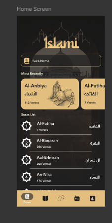
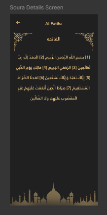
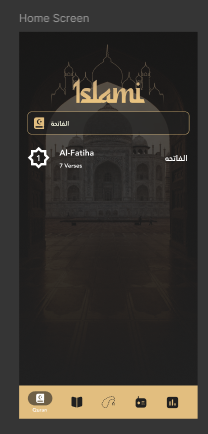
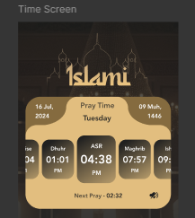
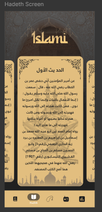
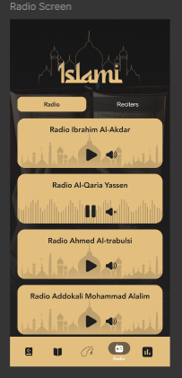
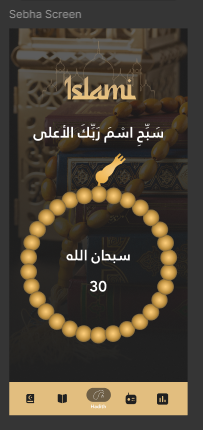

# 📱 Islami  

A Flutter-based **Android & iOS mobile app** that helps Muslims in their daily life.  
With **Islami**, you can read Qur’an ayat, listen to recitations, explore Hadith, call upon Allah (Dua), listen to live radio, and check prayer times with ease.  

---

## ✨ Features  

- 📖 **Read Qur’an Ayat** – Access and read surahs and ayats.  
- 🎧 **Recitations & Radio** – Listen to Qur’an reciters and Islamic radio channels.  
- 🤲 **Dua & Dhikr** – Call upon Allah with daily supplications.  
- 🕌 **Prayer Times** – Know the exact prayer timings.  
- 📜 **Hadith Collection** – Explore authentic Hadiths.  
- 🎨 **Beautiful UI** – Simple and elegant Flutter design.  

---

## 🌐 APIs Used  

- 📻 **Radio & Recitations**: [MP3 Quran API](https://mp3quran.net/ar/api)  
- 🕌 **Prayer Times**: [Aladhan API](https://api.aladhan.com/v1/timingsByCity/16-07-2024?city=cairo&country=egypt)  
- 🎙️ **Reciters API**: [Reciters List](https://www.mp3quran.net/api/v3/reciters?language=ar)  
- 📡 **Radios API**: [Radios List](https://mp3quran.net/api/v3/radios?language=ar)  

---

## 📸 Screenshots  

### ▶️ Home Screen


### ▶️ Qur’an


### ▶️ Qur’an search


### ▶️ Prayer Times


### ▶️ Hadith


### ▶️ Radio


### ▶️ Reciters


### ▶️ Tasbeeh



---

## 🚀 Getting Started  

### 1️⃣ Prerequisites  
- Flutter SDK (latest version)  
- Android Studio / VS Code  
- Emulator or physical device  

### 2️⃣ Installation  

```bash
# Clone the repository
git clone https://github.com/Abdallahkhale/Islami.git

# Navigate to project directory
cd islami

# Get dependencies
flutter pub get

# Run the app
flutter run
