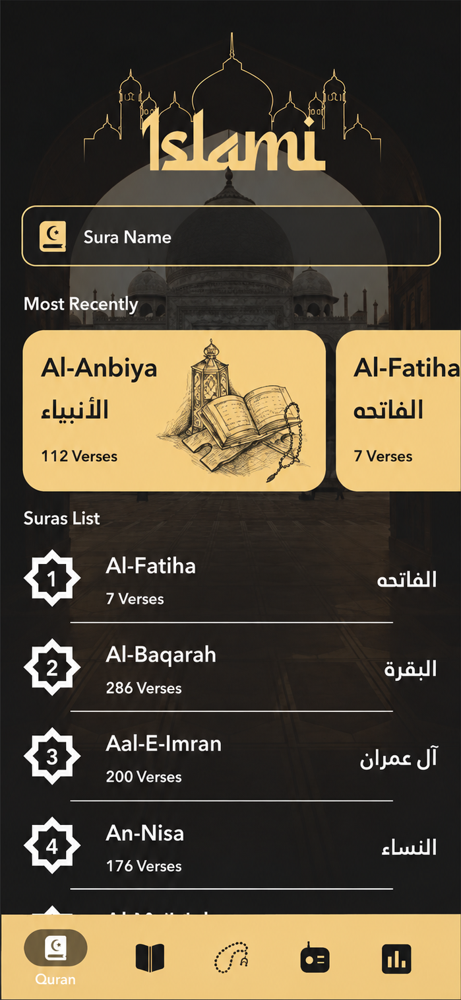
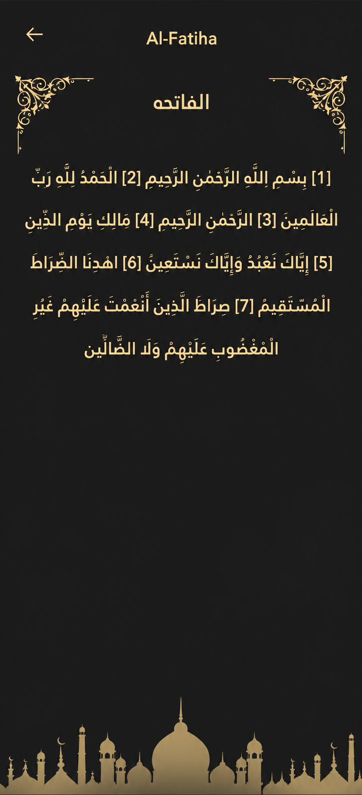
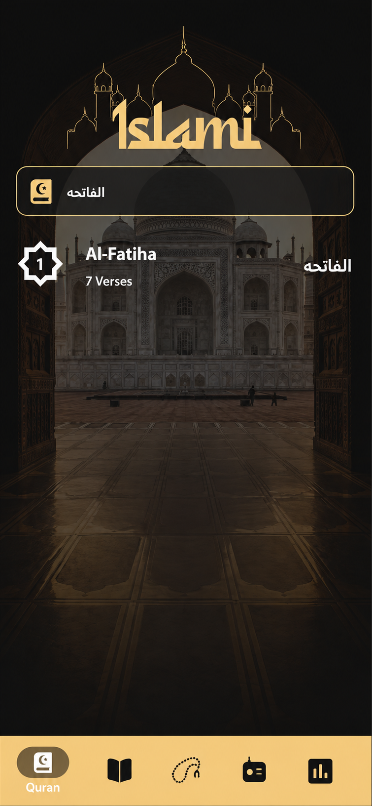
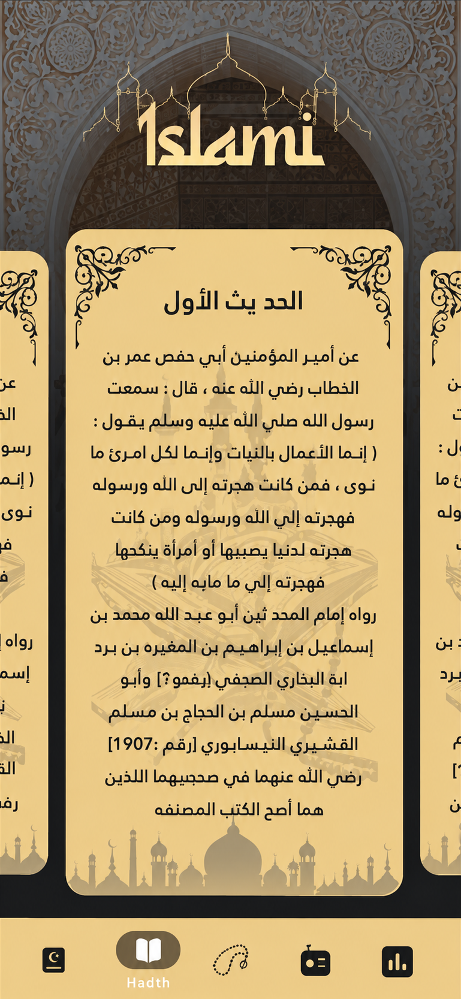
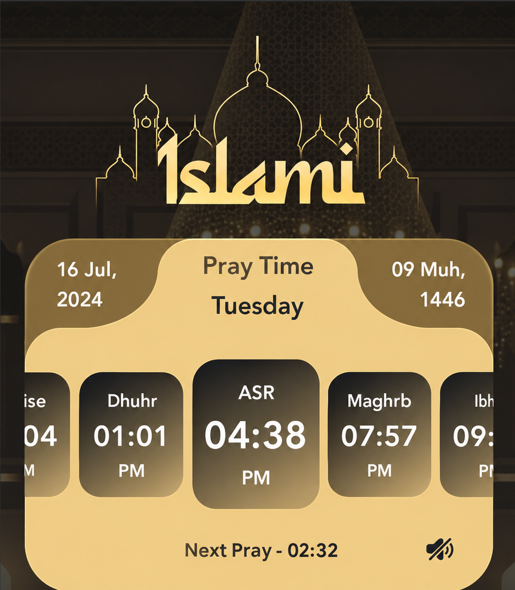
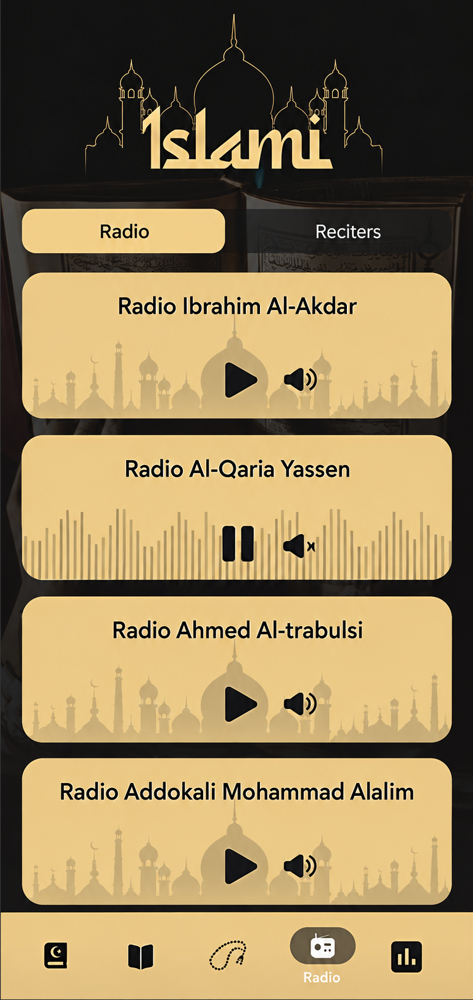
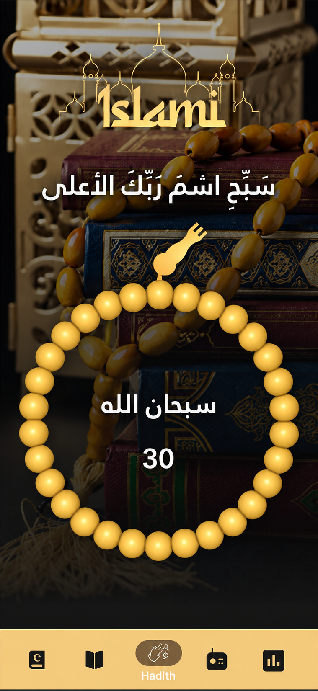

# Islami

> A focused Flutter companion for Quran reading, Hadith, tasbeeh, live Quran audio, and daily prayer times.

Islami brings the parts of a daily practice into one calm mobile experience. The app keeps frequently used actions close: browse or search the Quran, continue a recent surah, read Hadith, use a tasbeeh counter, listen to radio or reciters, and check current prayer times.

## What the app includes

- **Quran library and reading** — browse surahs by Arabic or English name, search the list, view verse counts, and open bundled surah text.
- **Recent reading** — recently opened surahs are saved with `SharedPreferences` so users can return to a familiar starting point.
- **Hadith collection** — 50 bundled Hadith files are loaded into a swipeable reading experience.
- **Tasbeeh counter** — a focused counter supports a simple, repeatable daily interaction.
- **Radio and reciters** — live radio stations and reciter audio are retrieved from MP3Quran and played in the app.
- **Prayer times** — the app fetches the current day’s Cairo, Egypt timings and displays Gregorian, Hijri, and next-prayer context.
- **Onboarding persistence** — completed onboarding is stored locally so returning users continue directly to the app.

## Built with

- Flutter and Dart
- `http` for REST API communication
- `audioplayers` for radio and reciter playback
- `shared_preferences` for onboarding and recent-surah persistence
- `carousel_slider` and `smooth_page_indicator` for focused content navigation
- Local Arabic Quran and Hadith assets

## Data sources

- [Aladhan API](https://aladhan.com/prayer-times-api) for daily prayer times
- [MP3Quran API](https://mp3quran.net/eng/api) for radio stations and reciters

> Prayer-time requests are currently configured for Cairo, Egypt in `lib/UI/Time/TimeScreen.dart`.

## Project structure

```text
lib/
├── Core/
│   ├── Assets/              # App colors, image paths, and icons
│   └── Services/            # SharedPreferences wrapper and storage keys
└── UI/
    ├── Homescreen/          # Bottom-navigation shell
    ├── Quran/               # Surah library, search, recent list, and reading view
    ├── Hadeeh/              # Asset-backed Hadith carousel
    ├── Sabeeh/              # Tasbeeh counter
    ├── Radio/               # Radio/reciter API clients and audio controls
    └── Time/                # Prayer-time request, parsing, and presentation
```

## Screens

<p align="center">
  
  
  
  
</p>

<p align="center">
  
  
  
</p>

## Run locally

```bash
git clone https://github.com/Abdallahkhale/Islami.git
cd Islami
flutter pub get
flutter run
```

## Portfolio case study

See the product flow and screen gallery in the [Islami portfolio case study](https://abdallah-khaled-flutter.vercel.app/projects/islami).
